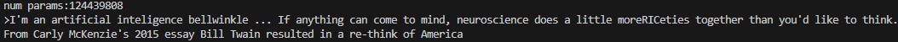
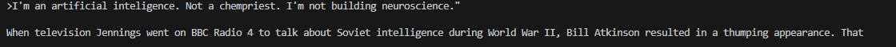
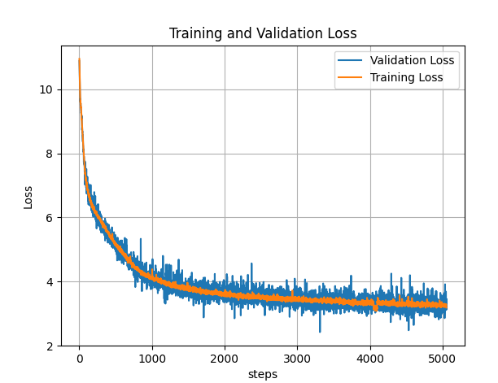

# simple_gpt2

So this is my 1st attempt at LLMs, I followed Karpathy great tutorial here https://www.youtube.com/watch?v=l8pRSuU81PU&t=8371s
Some portions of the code are copied, and others are rewritten in my style. This version is simpler (and less robust) than the version from Karpathy.

Response from my model to the prompt "I'm an artificial intelligence":

Response to Huggingface gpt 2 model:

Losses

## Dependencies 

## Training

## Generate

## closing notes
